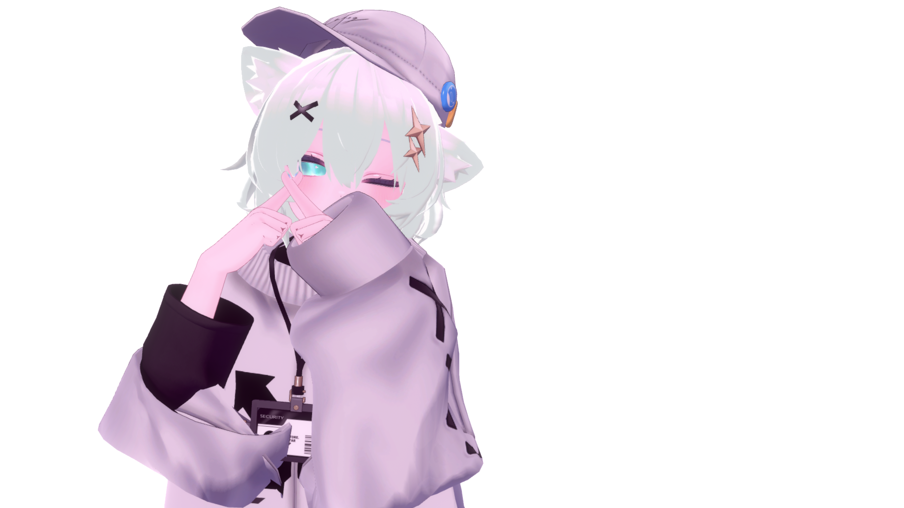

<p align="center">
  <a href="https://github.com/SphereStacking/SphereStacking">
    
  </a>
  <a href="http://twitter.com/SphereVR">
    
  </a>
  <a href="https://github.com/SphereStacking">
    
  </a>
  <a href="http://qiita.com/sphere-stacking">
    
  </a>
</p>
<h1 align="center">Hi 👋, I'm Sphere</h1>
<h3 align="center">A passionate developer in Japan</h3>

<h3 align="center">My knowledge</h3>
<p align="center">
    <code></code>
    <code></code>
    <code></code>
    <code></code>
    <code></code>
    <code></code>
    <code></code>
    <code></code>
    <code></code>
    <code></code>
    <code></code>
    <code></code>

</p>

``` json
  {
  "profile" : {
    "name" : "XX XX",
    "handlename" : "Sphere",
    "features" : [ "怠け者", "引きこもり", "コミュ症" ],
    "tolikes" : [
      "🟢(#bbffcc)","🏍️",
    ],
    "dislikes" : [
      "🦐"
    ],
    "career" : [
        { "jobtype":"Web Developer", "period":"2023/08 ~ now" },
        { "jobtype":"🚀🛰📡 Developer", "period":"2016/04 ~ 2023/07" }
    ],
    "links" : [
        { "service":"x", "url":"https://x.com/sphere-stacking"},
        { "service":"github", "url":"https://github.com/ShakeSpheres"},
        { "service":"qiita", "url":"https://qiita.com/sphere-stacking"},
        { "service":"pixiv fanbox", "url":"https://spherestacking.fanbox.cc/"}
    ]
  }
}
```

### 📝 I regularly write articles on [qiita](https://qiita.com/)

<p align="left">
  
<!-- BLOG-POST-LIST:START -->
<!-- BLOG-POST-LIST:END -->

</p>
<p></p>

<
<p></p>

